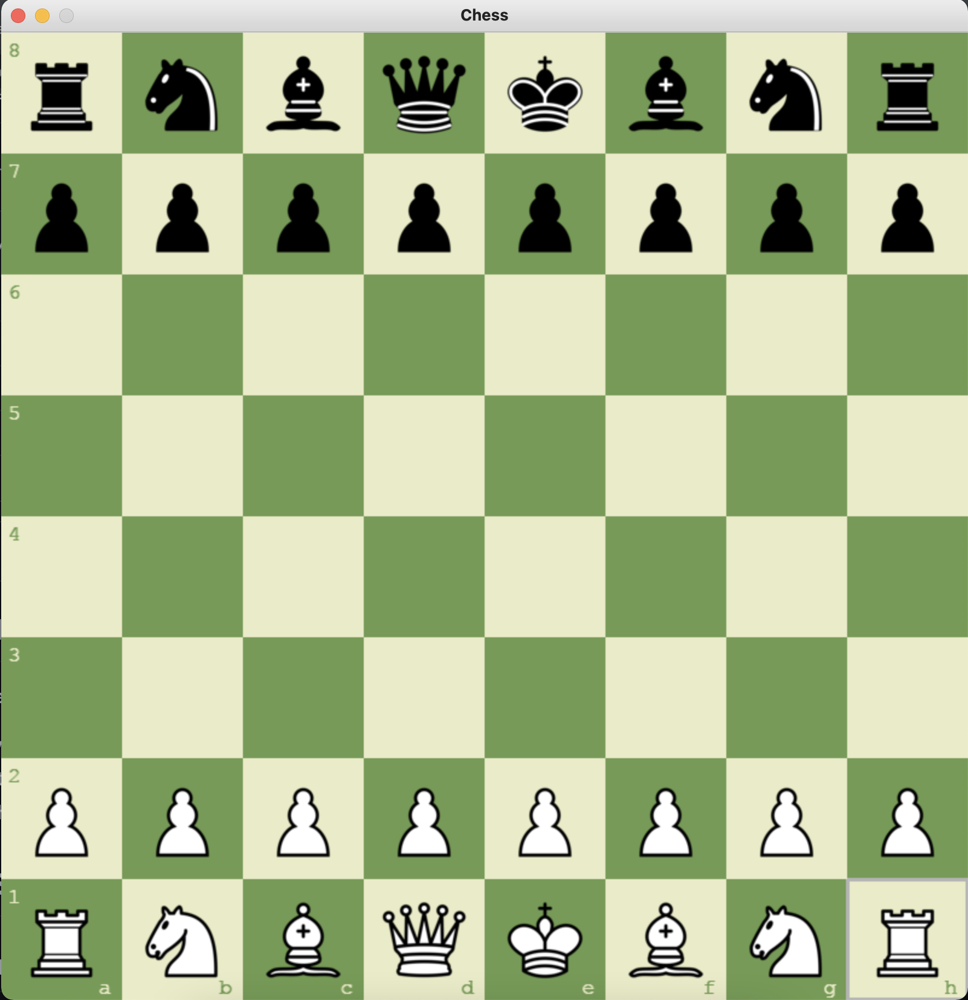
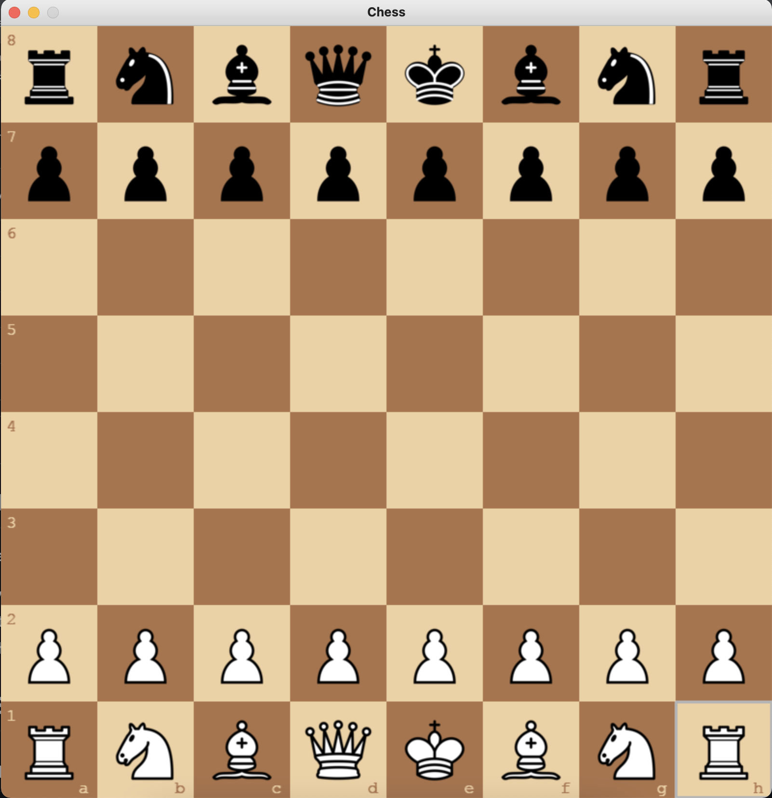
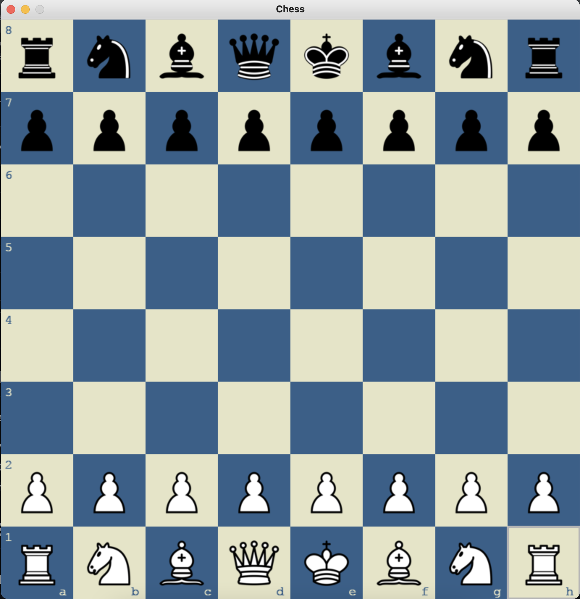
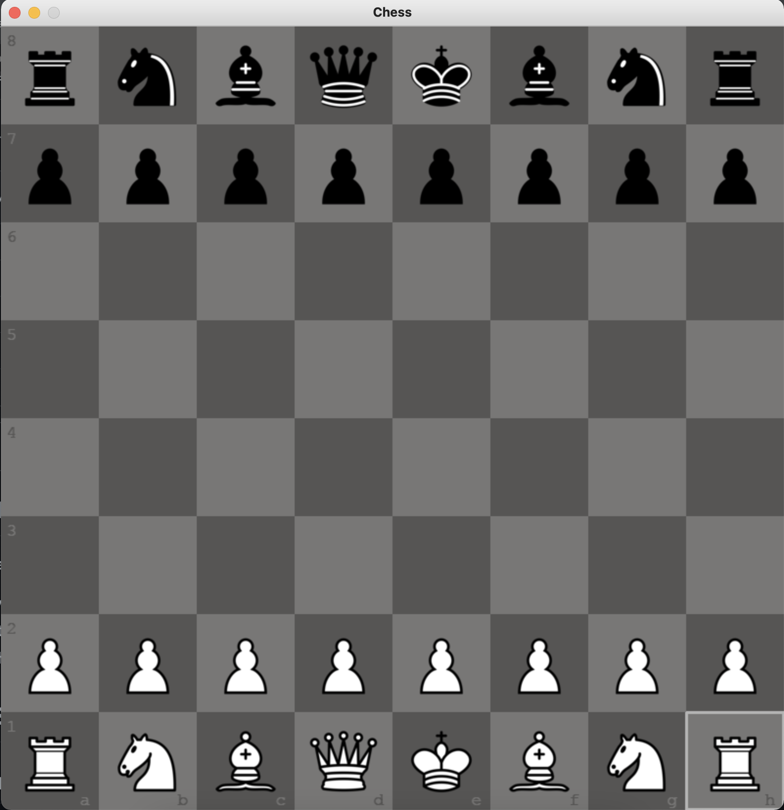
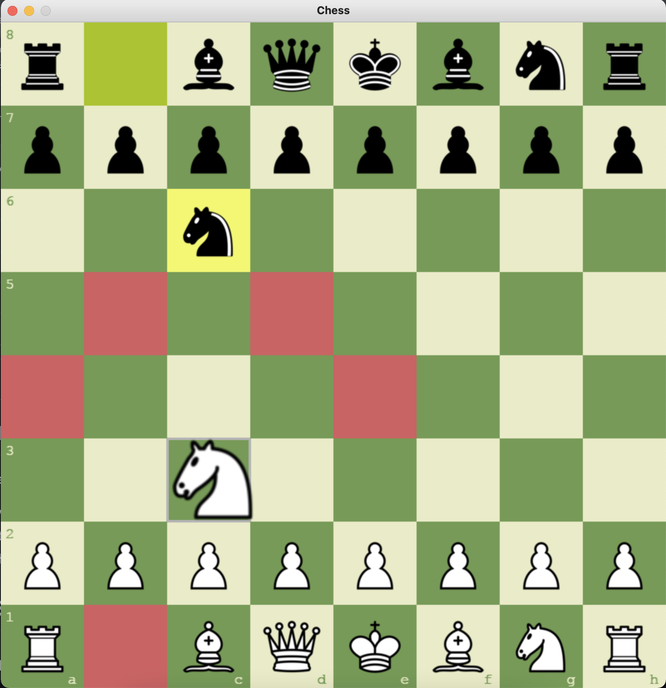
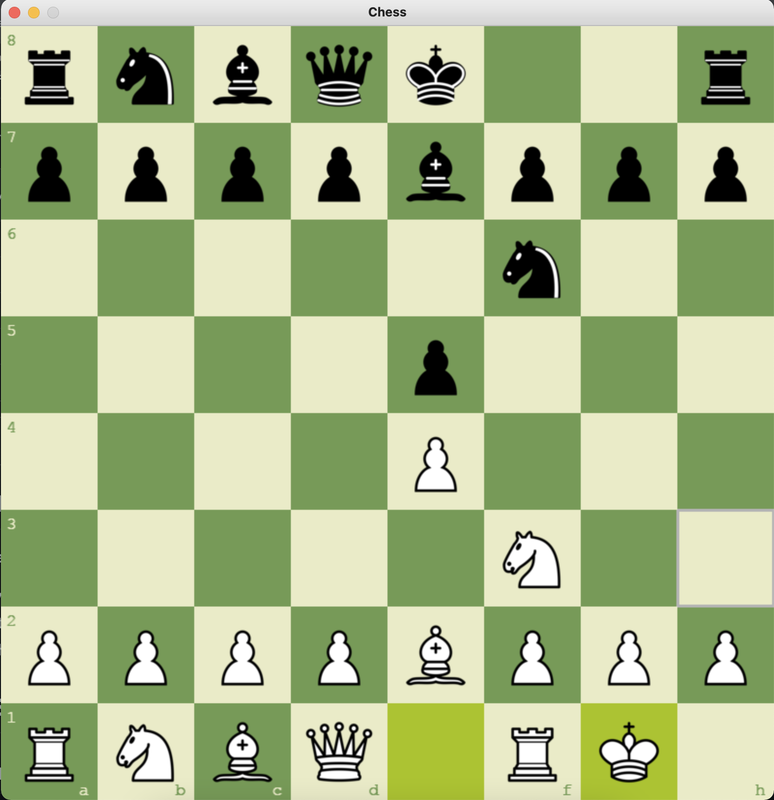

# Chess-StockFish

Chess-StockFish là một trò chơi cờ vua được phát triển bằng Python với giao diện đồ họa sử dụng Pygame, tích hợp engine Stockfish cho chế độ chơi với máy. Dự án hỗ trợ cả hai chế độ: **Người vs Người** và **Người vs Máy (AI)**. Phiên bản này cho phép người chơi trải nghiệm cờ vua với giao diện đẹp, âm thanh sống động và khả năng kiểm tra trạng thái nước đi hợp lệ, chiếu và chiếu bí.

## Tính năng

- **Hai chế độ chơi:**  
  - **Người vs Người:** Chơi cờ vua theo phong cách truyền thống.  
  - **Người vs Máy:** Tích hợp engine Stockfish, giúp tạo ra trí tuệ nhân tạo cho chế độ chơi với máy.

- **Giao diện đồ họa:**  
  - Hiển thị bàn cờ, quân cờ cùng các hiệu ứng chuyển động mượt mà.  
  - Hỗ trợ thay đổi giao diện (theme) với các lựa chọn: **xanh lá**, **nâu**, **xanh dương** và **xám**.

- **Âm thanh:**  
  - Hiệu ứng di chuyển và bắt quân, tăng trải nghiệm chơi game.

- **Kiểm tra trạng thái chiếu và chiếu bí:**  
  - Tự động phát hiện khi vua bị chiếu hoặc bị chiếu bí và thông báo kết quả trận đấu.

## Yêu cầu
- **Python 3.8+**
- **Thư viện Python:**
  - [pygame](https://www.pygame.org/news)
  - [stockfish](https://pypi.org/project/stockfish/) – thư viện giao tiếp với engine Stockfish qua giao thức UCI.
- **Binary của Stockfish:**
  - Tải về hoặc build phiên bản Stockfish phù hợp với hệ điều hành của bạn.
  - Đảm bảo đường dẫn tới binary Stockfish (thiết lập trong file `main.py`) là chính xác.

## Cài đặt

1. Clone hoặc tải về source/binary của Stockfish từ [Stockfish trên GitHub](https://github.com/official-stockfish/Stockfish).
   Hoặc tải từ https://stockfishchess.org/
   
3. Build theo hướng dẫn (nếu cần) và đặt file binary vào thư mục nội bộ (ví dụ: `stockfish/stockfish-windows-x86-64-avx2.exe`).

4. Cập nhật đường dẫn trong file `main.py` (dòng khởi tạo Stockfish) sao cho đúng với vị trí binary trên máy bạn.

---

## Hướng dẫn sử dụng

**1. Chạy game:**
Khởi chạy game bằng cách chạy file `main.py`:
   ```bash
    cd src
    python main.py
  ```

**2. Chọn chế độ chơi:**
Khi game khởi động, hệ thống sẽ yêu cầu bạn chọn **chế độ:**
  - **Người vs Người:** Nhập 1.  
  - **Người vs Máy:** Nhập 2.

Các phím chức năng:
  - **T**: Thay đổi giao diện chủ đề (theme).
  - **R**: Reset game để bắt đầu lại.

## Ý tưởng dự án:
Dự án này được lấy cảm hứng từ:
  - **Bàn cờ Python**: [python-chess-ai-yt](https://github.com/AlejoG10/python-chess-ai-yt/tree/master) – cung cấp ý tưởng về xây dựng bàn cờ và xử lý logic nước đi.
  - **Engine Stockfish**: [Stockfish](https://github.com/official-stockfish/Stockfish/tree/master) – engine mạnh mẽ dùng để đánh giá và tìm kiếm nước đi, được tích hợp cho chế độ chơi với máy.

# Game Snapshots

## Snapshot 1 - Start (green)


## Snapshot 2 - Start (brown)


## Snapshot 3 - Start (blue)


## Snapshot 4 - Start (gray)


## Snapshot 5 - Valid Moves


## Snapshot 6 - Castling

